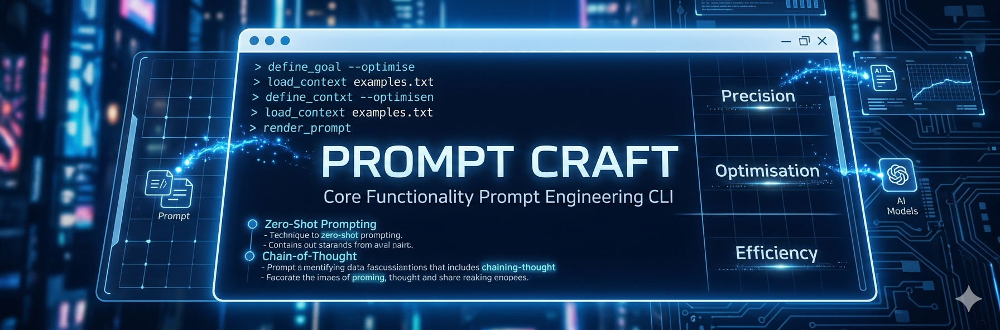

# PromptCraft — Prompt Engineering CLI

**Local LLM-powered prompt generator & consultant**


PromptCraft is a single-file CLI tool that leverages a locally running LLM (via Ollama or LM Studio) to help you craft production-ready prompts through an interactive discovery conversation. Instead of writing prompts from scratch, you chat with an AI consultant that asks targeted questions, then synthesizes a polished, technique-driven prompt you can copy, save, or pipe elsewhere.



## Features

- **Interactive Discovery Chat** — An AI consultant asks you smart, domain-specific questions to deeply understand your needs before generating a prompt.
- **8 Built-in Domains** — Code, Image Generation, Video, Slides, Writing, Music, AI Agent, and Custom — each with tailored quick-setup questions and technique recommendations.
- **8 Prompting Techniques** — Zero-Shot, One-Shot, Few-Shot, Instructional, Persona-Based, JSON Output, Chain-of-Thought, and Negative Prompting — with LLM-assisted technique suggestions.
- **Streaming Output** — Real-time token-by-token streaming for both discovery chat and prompt synthesis (toggle with `/stream`).
- **Plugin System** — Extend PromptCraft with custom example packs. Drop a `plugins/<name>/` directory with `plugin.json` and `examples.json` (plus an optional `plugin.py` Python hook).
- **Custom Domain Wizard** — Create your own domains with custom discovery questions and technique preferences (persisted across sessions via `/wizard`).
- **Headless / Quiet Mode** — Pipe-friendly non-interactive mode for automation and scripting.
- **Security Hardened** — SSRF protection (localhost-only URLs), input sanitization, path traversal prevention, and message length limits.
- **Clipboard & File Export** — One-command copy to clipboard or save prompts to timestamped files with full conversation context.
- **Persistent Config** — Backend and model selection are saved between sessions; domain and technique are always chosen fresh.

## Quick Start

### Prerequisites

- **Python 3.10+**
- **A running local LLM backend** — either:
  - [Ollama](https://ollama.ai) on `localhost:11434`, or
  - [LM Studio](https://lmstudio.ai) on `localhost:1234`
- **The `rich` Python package** — for the beautiful terminal UI

### Installation

```bash
# Clone or download the project files into a directory
# You need at minimum:
#   promptcraft.py
#   promptcraft_config.json
#   examples.json

# Install the required dependency
pip install rich

# (Optional) For clipboard support
pip install pyperclip
```

### Run

```bash
# Interactive mode — full startup wizard
python promptcraft.py

# Headless mode — skip all interactivity, pipe-friendly
python promptcraft.py --headless --domain image --technique negative --input "sunset over Cairo"

# Quiet mode — alias for --headless
python promptcraft.py --quiet --domain code --technique chain_of_thought --input "REST API in Python"

# Pipe input via stdin
echo "sunset over Cairo" | python promptcraft.py --headless --domain image --technique negative

# Stream output token-by-token (headless mode)
python promptcraft.py --headless --domain writing --technique persona --input "blog post" --stream

# Save output to a file
python promptcraft.py --headless --domain image --technique negative --input "sunset" --output prompt.txt
```

## Project Structure

```
promptcraft/
├── promptcraft.py            # Main CLI application (single-file, ~2800 lines)
├── promptcraft_config.json   # Saved backend + model configuration
├── examples.json             # Built-in few-shot & one-shot examples per domain
├── custom_domains.json       # User-created custom domains (generated at runtime)
├── plugins/                  # Plugin directory (created at runtime)
│   └── <plugin_name>/
│       ├── plugin.json       # Plugin metadata
│       └── examples.json     # Domain examples provided by the plugin
├── prompts/                  # Saved prompt exports (created at runtime)
│   └── <domain>_<timestamp>.txt
└── README.md
```

## File Descriptions

### `promptcraft.py`

The entire application in a single Python file. Contains five architectural layers:

| Layer | Component | Purpose |
|-------|-----------|---------|
| Constants & Config | `VERSION`, `BACKENDS`, `DOMAINS`, `TECHNIQUES`, etc. | All configuration, domain definitions, technique metadata, and security limits |
| Feature: Custom Domains | `_custom_domain_wizard()`, `_merge_custom_domains()` | Interactive wizard to create and persist user-defined domains |
| Feature: Plugin System | `PluginManager` class | Discovers and loads plugins from the `plugins/` directory with JSON + Python hook support |
| Security Helpers | `_sanitize_string()`, `_validate_url_is_localhost()`, `_safe_resolve_path()` | Input sanitization, SSRF prevention, path traversal protection |
| Layer 1: Backend Client | `BackendClient` class | Unified HTTP client for Ollama (NDJSON) and LM Studio (OpenAI-compatible SSE) with streaming support |
| Layer 2: Prompt Engine | `PromptEngine` class | Builds system prompts, applies technique rules, constructs example blocks, and synthesizes final prompts |
| Layer 3: Session Manager | `SessionManager` class | Manages the interactive chat loop, domain questions, slash commands, streaming, and post-generation actions |
| Config Management | `_load_config()`, `_save_config()`, `_quick_start_from_config()` | Persists backend + model between sessions |
| Layer 5: CLI Shell | `_render_banner()`, `_startup_wizard()`, `_select_backend()`, etc. | The interactive wizard flow — backend detection, model selection, domain/technique picking |
| Headless Mode | `_run_headless()` | Non-interactive mode for scripting and piping |
| Entry Point | `main()` | Argument parsing, plugin loading, session loop |

### `promptcraft_config.json`

Stores your backend and model selection so you don't have to re-choose on every run. Domain and technique are intentionally **not** saved — you pick those fresh every session.

```json
{
  "version": "0.2.0",
  "backend": "lmstudio",
  "model": "google/gemma-3-1b",
  "saved_at": "2026-05-06 18:10:21"
}
```

| Field | Description |
|-------|-------------|
| `version` | PromptCraft version that created the config |
| `backend` | `"ollama"` or `"lmstudio"` |
| `model` | Model identifier (varies by backend) |
| `saved_at` | Timestamp of when the config was saved |

To reset your config, either delete this file and restart, or use the `/config` command during a session.

### `examples.json`

Contains built-in example pairs used by the Few-Shot and One-Shot prompting techniques. These examples are loaded by `PromptEngine` and injected into the synthesis prompt as style references, helping the LLM understand the expected quality and structure of the output.

Structure:

```json
{
  "few_shot_examples": {
    "code": [
      { "user": "A Python function to reverse a string", "assistant": "def reverse_string(s: str) -> str: ..." },
      ...
    ],
    "image": [ ... ],
    "video": [ ... ],
    "slides": [ ... ],
    "writing": [ ... ],
    "music": [ ... ],
    "agent": [ ... ]
  },
  "one_shot_examples": {
    "code": { "user": "A function to check if a number is prime", "assistant": "def is_prime(n: int) -> bool: ..." },
    "image": { ... },
    "video": { ... },
    "slides": { ... },
    "writing": { ... },
    "music": { ... },
    "agent": { ... }
  }
}
```

| Section | Format | Usage |
|---------|--------|-------|
| `few_shot_examples` | Array of `{user, assistant}` objects per domain | Used when the Few-Shot technique is selected — up to 3 examples are shown to the LLM |
| `one_shot_examples` | Single `{user, assistant}` object per domain | Used when the One-Shot technique is selected — one example is shown to the LLM |

Plugins can extend these examples by providing their own `examples.json` in the plugin directory.

## Domains

Each domain comes with a set of quick-setup questions and technique recommendations tailored to its specific use case:

| Key | Domain | Icon | Quick Setup Questions |
|-----|--------|------|-----------------------|
| `code` | Code / Programming | 💻 | Language, Framework, Code type, Experience level |
| `image` | Image Generation | 🎨 | Aspect ratio, Resolution, Visual style, Usage |
| `video` | Video Generation | 🎬 | Duration, Aspect ratio, Resolution, Style |
| `slides` | Presentation / Slides | 📊 | Slide count, Audience, Format, Tone |
| `writing` | Writing / Copywriting | ✍️ | Content type, Tone, Length, Audience |
| `music` | Music / Audio | 🎵 | Genre, Duration, Mood, Purpose |
| `agent` | AI Agent / System | 🤖 | Agent type, Tools, Autonomy level, Output format |
| `custom` | Custom / Other | ⚡ | Category, Output type, Audience, Priority |

You can also create your own domains using the `/wizard` command.

## Prompting Techniques

| Key | Technique | Icon | Description | Best For |
|-----|-----------|------|-------------|----------|
| `zero_shot` | Zero-Shot | 🎯 | Direct instruction with no examples | Code, Writing, Agent |
| `one_shot` | One-Shot | 1️⃣ | One example pair before the main prompt | Code, Writing, Slides |
| `few_shot` | Few-Shot | 🔢 | 2-3 example pairs to guide output style | Code, Writing, Image, Music |
| `instructional` | Instructional | 📋 | Step-by-step numbered directives | Slides, Writing, Agent |
| `persona` | Persona-Based | 🎭 | Assigns a specific expert identity to the model | Writing, Code, Agent |
| `json_output` | JSON Output | 📦 | Forces structured JSON schema output | Code, Agent |
| `chain_of_thought` | Chain-of-Thought | 🔗 | Step-by-step reasoning before answering | Code, Agent, Writing |
| `negative` | Negative Prompting | 🚫 | Explicit exclusion list alongside the main prompt | Image, Video, Music |

When you start a session, PromptCraft can ask the LLM to recommend the best technique for your chosen domain. You can always override the suggestion.

## Session Commands

During an interactive session, the following slash commands are available:

| Command | Description |
|---------|-------------|
| `/generate` | Synthesize and output the final engineered prompt |
| `/copy` | Copy the last generated prompt to clipboard |
| `/save` | Save the last generated prompt to a timestamped file in `./prompts/` |
| `/technique <name>` | Switch prompting technique mid-session (e.g. `/technique persona`) |
| `/menu` | Return to main menu to select a new domain/technique |
| `/config` | Re-run the setup wizard and update saved config |
| `/clear` | Reset conversation history and start fresh |
| `/status` | Show current session info (backend, model, domain, technique, turns, etc.) |
| `/stream` | Toggle streaming output on/off |
| `/wizard` | Create a new custom domain |
| `/plugins` | Show loaded plugins and example packs |
| `/help` | Show available commands |
| `/quit` | Exit PromptCraft |

## Plugin System

Plugins allow you to extend PromptCraft with additional example packs for specific domains. A plugin is simply a directory inside `plugins/` with a `plugin.json` metadata file and an `examples.json` file.

### Plugin Directory Structure

```
plugins/
└── my_plugin/
    ├── plugin.json       # Required — metadata
    ├── examples.json     # Required — example pairs
    └── plugin.py         # Optional — Python hook for dynamic examples
```

### `plugin.json` Format

```json
{
  "name": "My Plugin",
  "version": "1.0",
  "description": "Extra examples for image and code domains",
  "domains": ["image", "code"]
}
```

### `examples.json` Format

Same structure as the built-in `examples.json` — contains `few_shot_examples` and `one_shot_examples` keyed by domain:

```json
{
  "few_shot_examples": {
    "image": [
      { "user": "A cat wearing a hat", "assistant": "Photorealistic cat wearing a top hat..." }
    ]
  },
  "one_shot_examples": {
    "code": {
      "user": "A Rust function to sort a vector",
      "assistant": "fn sort_vector(v: &mut Vec<i32>) { v.sort(); }"
    }
  }
}
```

### Python Hook (`plugin.py`)

For dynamically generated examples, create a `plugin.py` with an `on_load()` function that returns an examples dict:

```python
def on_load():
    return {
        "few_shot_examples": {
            "image": [
                {"user": "dynamic example", "assistant": "dynamic output"}
            ]
        }
    }
```

Python hook results override JSON examples for the same domain keys.

## Custom Domains

Create your own domain with the `/wizard` command or by editing `custom_domains.json` directly. Custom domains support:

- A unique key, display label, emoji icon, and theme color
- Recommended technique preferences
- Custom discovery questions (multiple choice or free-text)

### `custom_domains.json` Format

```json
{
  "game_design": {
    "icon": "🎮",
    "label": "Game Design",
    "color": "bright_magenta",
    "recommended_techniques": ["persona", "instructional", "few_shot", "zero_shot"],
    "questions": [
      {
        "key": "genre",
        "prompt": "Game genre",
        "choices": ["RPG", "FPS", "Puzzle", "Strategy", "Other"],
        "default": "1"
      },
      {
        "key": "platform",
        "prompt": "Target platform",
        "choices": ["PC", "Console", "Mobile", "Web", "Other"],
        "default": "1"
      }
    ],
    "created_at": "2026-05-06 18:30:00"
  }
}
```

Custom domains are merged into the runtime at startup and appear in the domain selection menu alongside built-in domains.

## CLI Reference

```
usage: promptcraft [-h] [--version] [--setup] [--list-techniques] [--list-domains]
                   [--headless] [--quiet] [--domain DOMAIN] [--technique TECHNIQUE]
                   [--input INPUT] [--backend BACKEND] [--model MODEL]
                   [--output OUTPUT] [--stream] [--answers ANSWERS]

PromptCraft — Local LLM Prompt Engineering CLI

options:
  -h, --help            show this help message and exit
  --version             show version and exit
  --setup               Force re-run the setup wizard (ignores saved config)
  --list-techniques     Show all prompting techniques and exit
  --list-domains        Show all supported domains and exit
  --headless            Headless mode: skip banner, discovery chat, and domain questions
  --quiet               Quiet mode: alias for --headless
  --domain DOMAIN       Domain key (e.g. image, code, writing) — required in headless mode
  --technique TECHNIQUE Technique key (e.g. negative, chain_of_thought) — required in headless mode
  --input INPUT         Input text / user request — required in headless mode (or pipe via stdin)
  --backend BACKEND     Backend key (ollama or lmstudio) — auto-detected if omitted
  --model MODEL         Model name — uses config or auto-detected if omitted
  --output OUTPUT       Save generated prompt to file (in addition to stdout)
  --stream              Stream output token-by-token to stdout (headless mode)
  --answers ANSWERS     Domain-specific answers as key=value pairs (comma-separated)
                        e.g. --answers "style=Digital art,resolution=1024x1024"
```

### Headless Mode Examples

```bash
# Generate an image prompt with negative prompting
python promptcraft.py --headless --domain image --technique negative --input "sunset over Cairo"

# Generate a code prompt with chain-of-thought reasoning
python promptcraft.py --quiet --domain code --technique chain_of_thought --input "REST API in Python"

# Pipe input and stream output
echo "cyberpunk city" | python promptcraft.py --headless --domain image --technique negative --stream

# Generate and save to file with domain-specific parameters
python promptcraft.py --headless --domain image --technique few_shot \
  --input "product photo of headphones" \
  --answers "style=Photorealistic,resolution=1024x1024,aspect_ratio=1:1 (Square)" \
  --output prompt.txt
```

## Architecture Overview

PromptCraft follows a layered architecture within a single file:

```
┌─────────────────────────────────────────────┐
│  Entry Point (main)                         │
│  CLI argument parsing, plugin loading,      │
│  session loop with menu-return support      │
├─────────────────────────────────────────────┤
│  Layer 5: CLI Shell / Wizard                │
│  Banner, backend detection, model listing,  │
│  domain & technique selection               │
├─────────────────────────────────────────────┤
│  Layer 3: Session Manager                   │
│  Chat loop, slash commands, streaming,      │
│  domain questions, post-generation actions  │
├─────────────────────────────────────────────┤
│  Layer 2: Prompt Engine                     │
│  System prompt builder, technique rules,    │
│  example injection, synthesis & streaming   │
├─────────────────────────────────────────────┤
│  Layer 1: Backend Client                    │
│  Unified Ollama + LM Studio client,         │
│  streaming (NDJSON + SSE), SSRF protection  │
├─────────────────────────────────────────────┤
│  Security Helpers                           │
│  Input sanitization, localhost-only URLs,   │
│  path traversal prevention, size limits     │
├─────────────────────────────────────────────┤
│  Feature Layer: Plugins & Custom Domains    │
│  PluginManager, Custom Domain Wizard,       │
│  config file management                     │
├─────────────────────────────────────────────┤
│  Constants & Configuration                  │
│  Version, backends, domains, techniques,    │
│  recommendations, theme, limits             │
└─────────────────────────────────────────────┘
```

## Security Considerations

PromptCraft includes several security measures designed for safe local use:

- **SSRF Prevention** — All HTTP requests are validated to target only `localhost`, `127.0.0.1`, `::1`, or `0.0.0.0`. The backend client will refuse any request to a non-loopback address.
- **Input Sanitization** — User inputs are stripped of control characters (null bytes, carriage returns) and truncated to safe maximum lengths before being sent to the LLM or written to disk.
- **Path Traversal Protection** — File save paths are resolved and verified to stay within the expected working directory.
- **Message Size Limits** — Individual messages are capped at 32,000 characters, conversation history at 200 messages, and config files at 64 KB to prevent resource exhaustion.
- **Atomic File Writes** — Config and custom domain files are written to temporary files first, then atomically renamed, reducing the risk of corrupt files on crash.

## Dependencies

| Package | Required | Purpose |
|---------|----------|---------|
| `rich` | Yes | Terminal UI framework (panels, tables, markdown rendering, live streaming) |
| `pyperclip` | No | Cross-platform clipboard support (falls back to `xclip`, `xsel`, `wl-copy`, `pbcopy`) |

Both Ollama and LM Studio communicate via standard HTTP using Python's built-in `urllib` — no additional HTTP client libraries are needed.

## Version

**0.2.0** — Streaming support, plugin system, custom domain wizard, headless mode, and security hardening.
